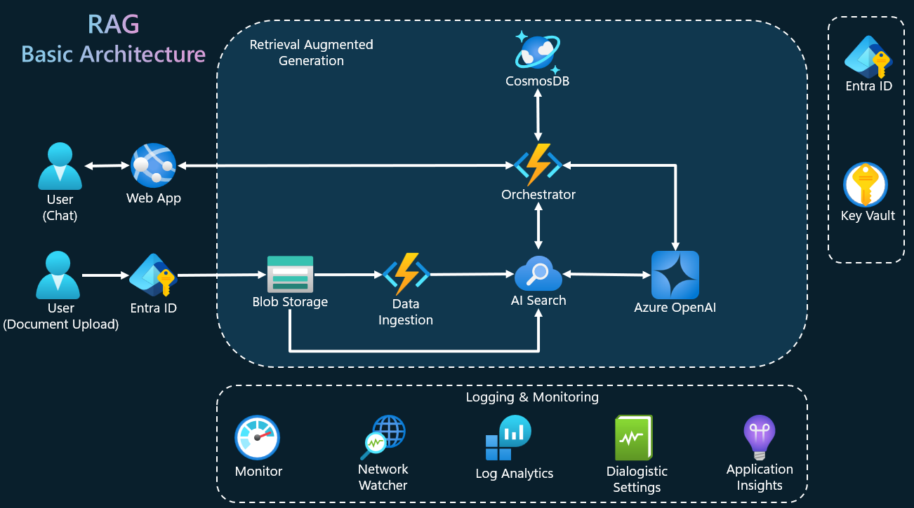

<!-- 
page_type: sample
languages:
- azdeveloper
- powershell
- bicep
products:
- azure
- azure-openai
- azure-ai-search
urlFragment: GPT-RAG
name: Multi-repo ChatGPT and Enterprise data with Azure OpenAI and AI Search
description: GPT-RAG core is a Retrieval-Augmented Generation pattern running in Azure, using Azure AI Search for retrieval and Azure OpenAI large language models to power ChatGPT-style and Q&A experiences.
-->
<!-- YAML front-matter schema: https://review.learn.microsoft.com/en-us/help/contribute/samples/process/onboarding?branch=main#supported-metadata-fields-for-readmemd -->


# Microhack - RAG AI & Your Data
## Presented by Microsoft Americas Office of the CTO
Originally from [GPT-RAG](https://github.com/Azure/gpt-rag)

The **RAG pattern** enables businesses to use the reasoning capabilities of LLMs, using their existing models to process and generate responses based on new data. RAG facilitates periodic data updates without the need for fine-tuning, thereby streamlining the integration of LLMs into businesses. 

The **Enterprise RAG** Solution Accelerator (GPT-RAG) offers a robust architecture tailored for enterprise-grade deployment of the RAG pattern. It ensures grounded responses and is built on Zero-trust security and Responsible AI, ensuring availability, scalability, and auditability. Ideal for organizations transitioning from exploration and PoC stages to full-scale production and MVPs.

## Application Components

GPT-RAG follows a modular approach, consisting of three components, each with a specific function.

* **[Data Ingestion](code/gpt-rag-ingestion)** - Optimizes data chunking and indexing for the RAG retrieval step.

* **[Orchestrator](code/gpt-rag-orchestrator)** - Coordinates the flow to retrieve information and generate a user response using Semantic Kernel functions.

* **[App Front-End](code/gpt-rag-frontend)** - Uses the [Backend for Front-End](https://learn.microsoft.com/en-us/azure/architecture/patterns/backends-for-frontends) pattern to provide a scalable and efficient web interface.

<!-- * [Teams-BOT](https://github.com/Azure/gpt-rag-bot) Constructed using Azure BOT Services, this platform enables users to engage with the Orchestrator seamlessly through the Microsoft Teams interface. -->

<!-- 
Removing temporarily while not finished
## GPT-RAG Integration HUB
* [SQL Integration](https://github.com/Azure/gpt-rag-int-sql) Connect the GPT-RAG Infrastructure to SQL using NL2SQL. -->

## Concepts

If you want to learn more about the RAG Pattern and GPT-RAG architecture.

* [RAG Pattern: What and Why?](docs/RAG_CONCEPTS.md)

* [Solution Architecture Overview](docs/ARCHITECTURE.md)

* [ZeroTrust Architecture Overview](media/GPT-RAG-ZeroTrust.png)

<!-- <a href="https://www.youtube.com/watch?v=ICsf4yirieA"></a> -->

## Setup Guide

1) **Basic Architecture Deployment:** *for quick demos with no network isolation*⚙️

Learn how to **quickly set up** the basic architecture for scenarios without network isolation. [Click the link to proceed](#basic-architecture-deployment).


## Getting Started

This guide will walk you through the deployment process of Enterprise RAG. Before beginning the deployment, please ensure you have prepared all the necessary tools and services as outlined in the **Pre-requisites** section.

**Pre-requisites**

- Azure Developer CLI: [Download azd for Windows](https://azdrelease.azureedge.net/azd/standalone/release/1.5.0/azd-windows-amd64.msi), [Other OS's](https://learn.microsoft.com/en-us/azure/developer/azure-developer-cli/install-azd).
 - Powershell 7+ with AZ module (Windows only): [Powershell](https://learn.microsoft.com/en-us/powershell/scripting/install/installing-powershell-on-windows?view=powershell-7.4#installing-the-msi-package), [AZ Module](https://learn.microsoft.com/en-us/powershell/azure/what-is-azure-powershell?view=azps-11.6.0#the-az-powershell-module)
 - Git: [Download Git](https://git-scm.com/downloads)
 - Node.js 16+ [windows/mac](https://nodejs.dev/en/download/)  [linux/wsl](https://nodejs.dev/en/download/package-manager/)
 - Python 3.11: [Download Python](https://www.python.org/downloads/release/python-3118/)
 - Initiate an [Azure AI services creation](https://portal.azure.com/#create/Microsoft.CognitiveServicesAllInOne) and agree to the Responsible AI terms **

** If you have not created an Azure AI service resource in the subscription before

### Basic Architecture Deployment

For quick demonstrations or proof-of-concept projects without network isolation requirements, you can deploy the accelerator using its basic architecture.


The deployment procedure is quite simple, just install the prerequisites mentioned above and follow these four steps using [Azure Developer CLI (azd)](https://aka.ms/azure-dev/install) in a terminal:


**1** Download the Repository:

```sh
azd init
```

**1.a** Give the environment a unique name. This will be used to create your resources. For example, _cowboy-hats_ would create resource group _rg-cowboy-hats_.
```sh
Enter a new environment name: some-name-here
```

**2** Login to Azure:

**2.a** Azure Developer CLI:

```sh
azd auth login
```

**2.b** Azure CLI:

```sh
az login
```
**2.c** Select your Azure Subscription from list.

**3** Start Building the infrastructure and components deployment:

```sh
azd up
```
**3.a** Select your Azure Subscription from list.

**3.b** Select Azure region. _Recommended: East US (eastus)_

**4** Add source documents to object storage from _/datasources_ directory.

Upload your documents to the 'documents' folder located in the storage account. The name of this account should start with 'strag'. This is the default storage account, as shown in the sample image below.

 

**Done! Basic deployment is completed.**

**Recommended**: [Add app authentication](https://learn.microsoft.com/en-us/azure/app-service/scenario-secure-app-authentication-app-service). [Watch this quick tutorial](https://youtu.be/sA-an25jMB4) for step-by-step guidance.

## How to?

### Customize Your Deployment

The standard deployment process sets up Azure resources and deploys the accelerator components with a standard configuration. To tailor the deployment to your specific needs, follow the steps in the [Custom Deployment](docs/CUSTOMIZATIONS.md) section for further customization options.

### Integrate with Additional Data Sources
  
Expand your data retrieval capabilities by integrating new data sources such as Bing Custom Search, SQL Server, and Teradata. For detailed instructions, refer to the [AI Integration Hub](docs/AI_INTEGRATION_HUB.md) page.

### Multi-Environment Deployment

Once you've successfully deployed the GPT-RAG solution as a proof of concept and you're ready to formalize the deployment using a proper CI/CD process to accelerate your deployment to production, refer to the multi-environment deployment guides for either [Azure DevOps](./docs/AZDO-SETUP.md) or [GitHub](./docs/GH-SETUP.md).
 
### Troubleshoot Deployment Issues

If you encounter any errors during the deployment process, consult the [Troubleshooting](docs/TROUBLESHOOTING.md) page for guidance on resolving common issues.

### Evaluate Performance

To assess the performance of your deployment, refer to the [Performance Testing](docs/PERFTEST.md) guide for testing methodologies and best practices.

### Query the Conversation History

Learn how to query and analyze conversation data by following the steps outlined in the [How to Query and Analyze Conversations](docs/QUERYING_CONVERSATIONS.md) document.

### Estimate Pricing

Understand the cost implications of your deployment by reviewing the [Pricing Model](https://github.com/Azure/GPT-RAG/wiki/GPT%E2%80%90RAG-%E2%80%90-Pricing-Model) for detailed pricing estimation.

### Manage Governance

Ensure proper governance of your deployment by following the guidelines provided in the [Governance Model](https://share.mindmanager.com/#publish/9ogrdWqzmAzZB6ilgURohV4lj1LriKjOWc0w_u2U).

## Contributing

We appreciate your interest in contributing to this project! Please refer to the [CONTRIBUTING.md](./CONTRIBUTING.md) page for detailed guidelines on how to contribute, including information about the Contributor License Agreement (CLA), code of conduct, and the process for submitting pull requests.

Thank you for your support and contributions!

## Trademarks

This project may contain trademarks or logos for projects, products, or services. Authorized use of Microsoft 
trademarks or logos is subject to and must follow 
[Microsoft's Trademark & Brand Guidelines](https://www.microsoft.com/en-us/legal/intellectualproperty/trademarks/usage/general).
Use of Microsoft trademarks or logos in modified versions of this project must not cause confusion or imply Microsoft sponsorship.
Any use of third-party trademarks or logos are subject to those third-party's policies.
